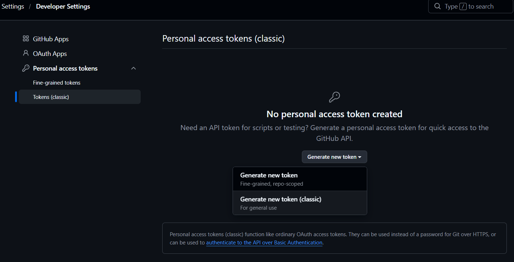
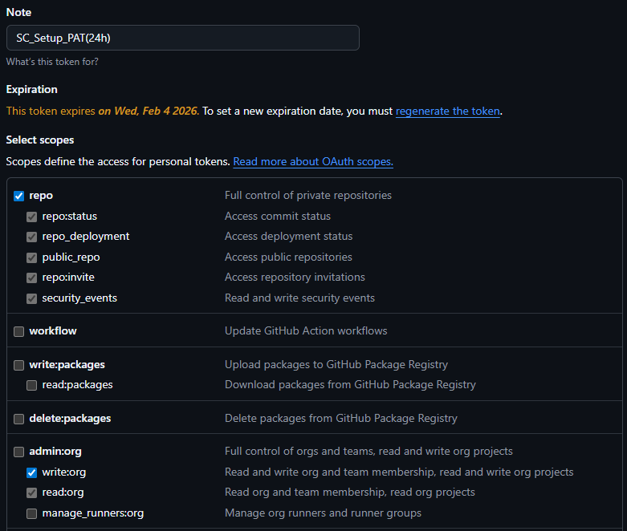
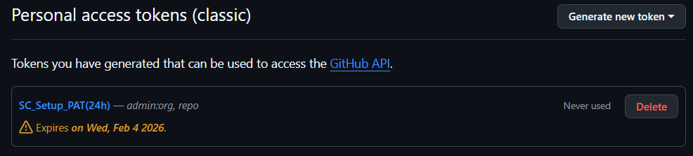

## [🏠 HOME](../ReadMe.md)

# GitHub PAT Scoping

## 1: Head Over to:  
[GitHub PAT Tokens](https://github.com/settings/tokens)  

## 2: Once there click generate new token (Classic)
  
## 3: Configure as per the screenshot below
## 4: Change expiration date the following day
This will enable the PAT Token to be as short as it posibly can be. 
   

## 5: Copy PAT Token for use at Runtime

# GetHub Revoking PAT Token
## 6: Once you've run the deployment you can revoke the token
  